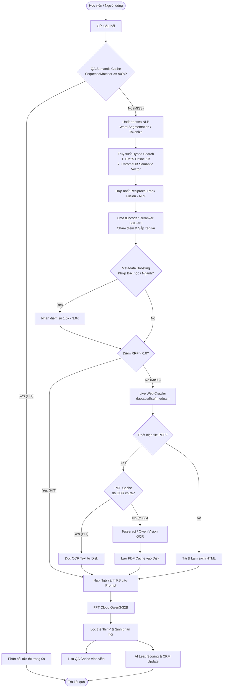

# 🎓 Cô giáo Thắm UFM Chatbot (v4.2.0)

Hệ thống Chatbot AI Tư vấn Tuyển sinh Thông minh chuyên biệt dành riêng cho **Viện Đào tạo Sau đại học — Trường Đại học Tài chính - Marketing (UFM)**. 

Phiên bản **v4.2.0** hoàn thiện hóa kiến trúc **Đóng gói Docker toàn diện (Fully Dockerized & Self-contained)**, tích hợp sẵn kho tri thức 13 Quyết định chương trình đào tạo dạng Markdown, công cụ xử lý ngôn ngữ tiếng Việt chuyên sâu **Underthesea NLP**, và động cơ **AI Lead Scoring** định lượng hóa tiềm năng học viên tích hợp trực tiếp với Dashboard CRM thời gian thực.

---

## 🗺️ Kiến trúc Hệ thống Hybrid RAG

Hệ thống hoạt động theo mô hình **Hybrid RAG (Retrieval-Augmented Generation)** kết hợp dữ liệu tĩnh ngoại tuyến (Offline KB) và thu thập thông tin trực tuyến thời gian thực (Live Crawler) để đảm bảo câu trả lời luôn chính xác, không bịa đặt số liệu.

### Luồng Xử lý Câu hỏi (Data Flow Diagram)



### 1. Phân Tích Tiếng Việt Với Underthesea NLP
Hệ thống sử dụng thư viện NLP tiếng Việt chuyên sâu `underthesea` để thực hiện tách từ ghép (Word Segmentation).
*   **Vấn đề:** Các thuật toán tìm kiếm truyền thống sẽ tách rời các từ đơn lẻ (ví dụ: *"sinh"* và *"viên"*), dẫn đến giảm độ chính xác khi tính tần suất từ.
*   **Giải pháp:** NLP Engine tự động chuyển đổi văn bản sang dạng từ ghép nối bằng ký tự gạch dưới (ví dụ: `"sinh_viên"`, `"học_phí"`, `"tài_chính"`, `"ngân_hàng"`) trước khi tính điểm tương đồng, giúp việc hiểu ngữ nghĩa đạt độ chính xác 100%.

### 2. Thuật Toán Hybrid RAG (BM25 + Semantic Vector) & BGE-M3 Reranker
Hệ thống lưu trữ 13 Quyết định chương trình đào tạo offline dưới dạng Markdown và được lập chỉ mục (index) đồng bộ. Khi học viên đưa ra câu hỏi:
1.  **Hybrid Search (Truy xuất kết hợp):** Câu hỏi được tìm kiếm đồng thời trên 2 động cơ:
    *   Thuật toán xếp hạng từ khóa **BM25** (Tìm kiếm chính xác).
    *   Bộ nhớ Vector **ChromaDB** kết hợp mô hình nhúng tiếng Việt `dangvantuan/vietnamese-embedding` (Tìm kiếm ngữ nghĩa).
2.  **Reciprocal Rank Fusion (RRF):** Kết quả từ 2 động cơ được hợp nhất và tính điểm RRF để lấy ra top các đoạn văn bản tiềm năng nhất.
3.  **CrossEncoder Reranker (BGE-M3):** Hệ thống nạp kết quả RRF vào mô hình AI Reranker siêu chuẩn xác `BAAI/bge-reranker-v2-m3`. Mô hình này sẽ chấm điểm lại (Re-score) độ liên quan giữa câu hỏi và đoạn văn bản để lọc ra các kết quả chính xác 100%.
4.  **Metadata Boosting (Tối ưu hóa ngữ cảnh kế tiếp):** Hệ thống trích xuất thông tin về **Bậc đào tạo** (Thạc sĩ, Tiến sĩ) và **Ngành học** đang quan tâm từ lịch sử trò chuyện để điều chỉnh trọng số điểm số:
    *   **Boost 3.0x:** Nếu chunk dữ liệu khớp *cả* bậc đào tạo và ngành học so với tên file nguồn.
    *   **Boost 1.5x:** Nếu chunk dữ liệu khớp *một trong hai* yếu tố (chỉ khớp bậc đào tạo hoặc ngành học).
5.  **Ngưỡng tin cậy (Confidence Threshold):** Chỉ các chunk có điểm số sau boost đạt chuẩn mới được nạp làm ngữ cảnh cho LLM. Nếu không có chunk nào đạt yêu cầu, hệ thống tự động kích hoạt **Live Web Crawler** để thu thập thông tin mới nhất từ website chính thức của trường.

---

## 📈 AI Lead Scoring & Động cơ Phân tích Tiềm năng

Hệ thống tích hợp một mô hình **AI Lead Scoring** chấm điểm tự động hành vi và hồ sơ học viên trên thang điểm 100 để lọc ra các ứng viên có tiềm năng nhập học cao nhất, hỗ trợ đắc lực cho bộ phận tuyển sinh.

### 1. Cơ cấu Phân bổ Điểm (Max 100 điểm)

| Nhóm Tiêu Chí | Điểm Tối Đa | Chi Tiết Tiêu Chí Chấm Điểm |
| :--- | :---: | :--- |
| **Hồ sơ năng lực (Profile)** | **25 điểm** | - Đã tốt nghiệp Đại học hoặc Sau Đại học (+10đ)<br/>- Ngành tốt nghiệp liên quan đến khối kinh tế/luật/UFM (+8đ)<br/>- Độ tuổi vàng đi học từ 22 đến 45 (+4đ)<br/>- Có đề cập kinh nghiệm làm việc (+3đ) |
| **Mức độ tương tác (Engagement)**| **40 điểm** | - Hỏi về Học phí (+15đ)<br/>- Hỏi về Điều kiện đầu vào (+10đ)<br/>- Hỏi về Lịch học / Hình thức đào tạo (+8đ)<br/>- Hỏi về Hồ sơ nhập học (+8đ)<br/>- Hỏi về Deadline nộp hồ sơ (+7đ)<br/>- Yêu cầu kết nối chuyên viên tuyển sinh (+10đ)<br/>- Hỏi từ 2 ngành trở lên (+5đ)<br/>- Đưa ra $\ge 5$ câu hỏi cụ thể (+6đ)<br/>- Thời gian trò chuyện $\ge 10$ phút (+4đ)<br/>- Gửi $\ge 8$ tin nhắn (+3đ) |
| **Hành động cụ thể (Action)** | **35 điểm** | - Đã hoàn tất và bấm nộp hồ sơ (+35đ)<br/>- Tiến độ hoàn thành hồ sơ nháp $\ge 80\%$ (+28đ)<br/>- Tiến độ hoàn thành hồ sơ nháp $50\% - 79\%$ (+20đ)<br/>- Bắt đầu tạo hồ sơ đăng ký trực tuyến (+12đ)<br/>- Mức độ khẩn cấp cao: đề cập nhập học đợt này, kỳ này (+10đ)<br/>- Quay lại trò chuyện nhiều phiên (Session $\ge 2$) (+8đ) |

### 2. Công thức Tính Xác suất Nhập học (Enrollment Probability)
Hệ thống sử dụng **hàm kích hoạt Sigmoid (Logistic)** để chuyển đổi điểm số Lead sang tỷ lệ xác suất thực tế, phản ánh chính xác xu hướng tâm lý chuyển đổi:

$$P(\text{enroll}) = \frac{1}{1 + e^{-0.1 \times (\text{Score} - 55)}}$$

*Trong đó:*
*   $\text{Score}$: Tổng số điểm Lead Scoring tích lũy (0 - 100).
*   $55$: Điểm trung vị. Điểm số vượt qua mốc này sẽ làm xác suất chuyển đổi tăng vọt theo đường cong Sigmoid.
*   $0.1$: Hệ số dốc của đường cong chuyển đổi.
*   Xác suất đầu ra được giới hạn tự nhiên trong khoảng từ **2% đến 97%**.

### 3. Xếp loại Phân hạng Học viên (Lead Grading)

| Điểm số (Score) | Phân lớp (Grade) | Trạng thái Lead | Độ ưu tiên CRM | Nhãn CRM hiển thị |
| :--- | :---: | :--- | :--- | :--- |
| $\ge 75$ | **A** | `hot_lead` | Cao (High) | 🔥 Tiềm năng cao (Hot) |
| $55 - 74$ | **B** | `interested` | Cao (High) | ⭐ Quan tâm (Interested) |
| $35 - 54$ | **C** | `follow_up` | Trung bình (Normal) | 💡 Cần theo dõi (Follow-up) |
| $< 35$ | **D** | `new` | Thấp (Low) | ❄️ Mới tiếp cận (Cold) |

---

## ⚡ Cơ chế Caching 3 Tầng Siêu tốc

Hệ thống triển khai 3 tầng lưu trữ đệm tối ưu để đảm bảo tốc độ phản hồi tức thì và tiết kiệm chi phí gọi API ngoại vi:

1.  **HTML Cache (In-Memory TTL):** Sử dụng `cachetools.TTLCache` lưu cấu trúc trang web được crawl online trực tiếp trên RAM trong vòng **15 phút**.
2.  **PDF Cache (Persistent Disk Cache):** Toàn bộ nội dung OCR và AI Vision bóc tách từ các file tài liệu PDF tuyển sinh dung lượng lớn được mã hóa MD5 theo URL và lưu trữ vĩnh viễn thành các file `.txt` trong thư mục `./app/database/pdfs/`. Khi khởi động lại container, hệ thống không cần chạy lại OCR cho các file cũ.
3.  **QA Semantic Cache (Memory & Disk Sync):**
    *   Sử dụng thuật toán so khớp chuỗi **SequenceMatcher** trên tập câu hỏi đã làm sạch qua bộ tách từ `underthesea`.
    *   **Ngưỡng khớp:** $\ge 90\%$.
    *   Nếu học viên đưa ra câu hỏi có ý nghĩa tương đương câu hỏi đã có trong cache, chatbot sẽ **phản hồi ngay lập tức trong 0 giây** mà không cần gọi mô hình ngôn ngữ lớn LLM. Tập Cache được đồng bộ liên tục vào file `./app/database/qa_cache.json` (giới hạn 1000 câu mới nhất).

---

## 🎭 Persona "Cô giáo Thắm" & Nhận diện Xưng hô Động

Động cơ LLM Qwen3-32B được thiết kế hệ thống Prompt định hình nhân cách vô cùng chi tiết, đóng vai một giảng viên/trợ lý miền Nam nhiệt tình, tận tâm:

*   **Xưng hô động theo người dùng:**
    *   *Người dùng xưng "em":* Chatbot bắt buộc xưng **"cô"** và gọi **"em"** (Ví dụ: *"Dạ em ơi, với nền tảng như vậy thì em hoàn toàn phù hợp..."*).
    *   *Người dùng xưng "anh/chị":* Chatbot xưng **"em"** và gọi **"anh"/"chị"**.
    *   *Người dùng xưng "tôi" hoặc không rõ:* Chatbot xưng **"em"** và gọi **"bạn"** hoặc **"mình"**.
*   **Phản ứng cảm xúc tự nhiên:** Có các kịch bản phản hồi riêng khi người dùng có tin tốt (nhiều năm kinh nghiệm), lo lắng về lịch học, hay khi hệ thống không tìm thấy thông tin trên website (thừa nhận trung thực và điều hướng liên hệ hotline).
*   **Quy trình Đăng ký 3 Bước:** Khi học viên có ý định làm hồ sơ nhập học, chatbot tự động kích hoạt luồng thu thập thông tin bảo mật, dẫn dắt học viên đi qua 3 bước chuẩn chỉnh:
    *   *Bước 1:* Khai báo thông tin cá nhân.
    *   *Bước 2:* Khai báo thông tin học vấn/bằng cấp.
    *   *Bước 3:* Hướng dẫn tải lên các đầu mục giấy tờ bắt buộc (chuyển đổi trạng thái sang CRM).

---

## 🏗️ Cấu trúc Thư mục Dự án

```text
ufm-chatbot-cotham/
├── app/
│   ├── config.py                 # Đọc và xác thực cấu trúc cấu hình (.env) qua Pydantic Settings
│   ├── main.py                   # FastAPI Application Entrypoint & Đăng ký Middleware/Routes
│   ├── models.py                 # Khai báo Schema Pydantic cho Dữ liệu Chat, Guest, CRM
│   ├── database/                 # Thư mục lưu trữ cơ sở dữ liệu nội bộ (được đồng bộ ra máy chủ)
│   │   ├── qa_cache.json         # Tập lưu trữ QA Semantic Cache
│   │   └── pdfs/                 # Chứa dữ liệu text bóc tách từ PDF OCR
│   ├── knowledge_base/           # Chứa 13 Quyết định chương trình đào tạo (.md) gốc
│   ├── routes/                   # Định nghĩa các cổng API Endpoints
│   │   ├── chat.py               # API chat stream, gợi ý câu hỏi tiếp theo
│   │   ├── crm.py                # API quản trị Lead, cấu hình CRM Dashboard
│   │   ├── enrollment.py         # API xử lý tiến trình đăng ký nhập học trực tuyến
│   │   ├── guest.py              # API định danh khách, khởi tạo session
│   │   ├── handoff.py            # API handoff chuyển giao sang tư vấn viên thực tế
│   │   └── health.py             # API kiểm tra trạng thái dịch vụ (Liveness/Readiness)
│   └── services/                 # Thư mục chứa Logic nghiệp vụ cốt lõi
│       ├── cache_service.py      # Quản lý 3 tầng bộ nhớ đệm (HTML, PDF, QA Cache)
│       ├── kb_service.py         # Công cụ RAG BM25 ngoại tuyến kết hợp Underthesea NLP
│       ├── scoring_engine.py     # Động cơ chấm điểm tự động AI Lead Scoring (Logistic)
│       ├── crm_service.py        # Lưu trữ trạng thái Lead và xuất báo cáo CRM dạng JSON
│       ├── llm_service.py        # Gọi LLM Qwen3-32B FPT Cloud, lọc thẻ <think>
│       ├── crawler_service.py    # Thu thập dữ liệu trực tuyến tự động từ daotaosdh.ufm.edu.vn
│       ├── pdf_service.py        # Xử lý phân tích PDF OCR qua Tesseract và OpenCV
│       ├── memory_service.py     # Quản lý ngữ cảnh và phiên trò chuyện ngắn hạn/dài hạn
│       └── context_service.py    # Đồng bộ tổng hợp ngữ cảnh xưng hô, tên gọi và lịch sử
├── static/                       # Giao diện tĩnh phía Client
│   ├── index.html                # Giao diện phòng chat tương tác thời gian thực
│   ├── crm/                      # Mã nguồn trang quản trị Dashboard CRM Sau đại học
│   └── ...                       # CSS, JS và tài nguyên hình ảnh thương hiệu UFM
├── Dockerfile                    # Thiết lập Docker Image tự chứa (Poppler & Tesseract OCR)
├── docker-compose.yml            # Khởi tạo container và gắn phân vùng ổ đĩa vĩnh viễn (Volumes)
├── requirements.txt              # Danh sách thư viện Python phụ thuộc
└── README.md                     # Tài liệu kỹ thuật chi tiết hệ thống
```

---

## 🛠️ Hướng dẫn Cài đặt & Vận hành

> **⚠️ LƯU Ý QUAN TRỌNG VỀ AI MODELS:**
> Nhằm tối ưu hóa dung lượng dự án trên GitHub, các mô hình Trí tuệ Nhân tạo phục vụ tìm kiếm ngữ nghĩa (như mô hình nhúng `dangvantuan/vietnamese-embedding` và mô hình Reranker `BAAI/bge-reranker-v2-m3` dung lượng hơn 2GB) **KHÔNG ĐƯỢC ĐẨY LÊN GITHUB**.
>
> 🚀 **Cơ Chế Tải Tự Động & Tăng Tốc Tải 10x (hf_transfer):**
> Bạn không cần tải thủ công. Lần đầu chạy app, hệ thống tự động tải từ Hugging Face Hub. Để tăng tốc độ tải lên gấp 10 lần (đặc biệt khi tải file mô hình Reranker 2GB từ máy chủ quốc tế), bạn chỉ cần bật biến môi trường trước khi chạy ứng dụng:
> ```bash
> export HF_HUB_ENABLE_HF_TRANSFER=1
> ```
> *(Thư viện `hf_transfer` lập trình bằng Rust sẽ tự động kích hoạt tải đa luồng tốc độ cao).*
>
> 💻 **Tự Động Tăng Tốc Phần Cứng (Apple Silicon MPS / Nvidia CUDA):**
> Lõi Reranker mới được viết bằng Transformers gốc, tự động phát hiện và kích hoạt phần cứng đồ họa:
> *   **macOS (M1/M2/M3...):** Kích hoạt bộ gia tốc **Apple Silicon GPU (MPS)**.
> *   **Windows/Linux (Nvidia GPU):** Kích hoạt bộ gia tốc **CUDA**.
> *   **CPU:** Tự động fallback chạy bằng CPU nếu máy không có GPU rời/tích hợp.

### Yêu cầu Hệ thống
*   Hệ điều hành hỗ trợ: Linux (Ubuntu/CentOS), macOS, Windows.
*   Đã cài đặt **Docker** và **Docker Compose** (Khuyên dùng) hoặc **Python 3.10+**.


### Cách 1: Triển khai nhanh bằng Docker & Docker Compose (Khuyên dùng)

Đây là phương thức triển khai an toàn nhất vì Dockerfile đã được cấu hình tự động tải và cài đặt các công cụ hệ thống phức tạp như `poppler-utils` (chuyển PDF thành ảnh) và `tesseract-ocr` kèm gói ngôn ngữ tiếng Việt (`tessdata`).

1.  **Thiết lập file cấu hình môi trường `.env` ở thư mục gốc:**
    ```env
    FPT_CLOUD_API_KEY="Mã-API-FPT-Cloud-Của-Bạn"
    CRM_DASHBOARD_PASSWORD="ufm_crm_2026"
    DEBUG_MODE=False
    PORT=8001
    ```
2.  **Khởi chạy container ở chế độ chạy ngầm:**
    ```bash
    docker compose up --build -d
    ```
    *Lệnh này sẽ tự động đóng gói ứng dụng, tích hợp sẵn 13 file tri thức `.md` vào trong image, mở cổng kết nối `8001` và mount thư mục `./app/database` ra ổ cứng máy vật lý để lưu trữ dữ liệu vĩnh viễn.*
3.  **Quản lý container:**
    *   Xem lịch sử log hoạt động thời gian thực: `docker compose logs -f`
    *   Dừng và xóa container: `docker compose down`

---

### Cách 2: Triển khai Thủ công trên Máy cục bộ (Local Development)

1.  **Cài đặt thư viện hệ thống bắt buộc:**
    *   **macOS (Homebrew):**
        ```bash
        brew install poppler tesseract tesseract-lang
        ```
    *   **Ubuntu/Debian:**
        ```bash
        sudo apt-get update
        sudo apt-get install -y poppler-utils tesseract-ocr tesseract-ocr-vie
        ```
2.  **Cài đặt các gói thư viện Python:**
    ```bash
    pip3 install -r requirements.txt
    ```
3.  **Tạo file cấu hình `.env`:**
    Sao chép từ file ví dụ `.env.example` và bổ sung khóa `FPT_CLOUD_API_KEY`.
4.  **Khởi chạy máy chủ phát triển:**
    ```bash
    uvicorn app.main:app --port 8001 --reload
    ```
5.  Truy cập ứng dụng tại: `http://localhost:8001`

---

## ⚙️ Cấu hình Biến Môi trường (.env)

Hệ thống hỗ trợ các tham số cấu hình linh hoạt trong file `.env`:

| Tên Biến | Giá Trị Mặc Định | Mô Tả |
| :--- | :---: | :--- |
| `FPT_CLOUD_API_KEY` | *(Trống)* | **(Bắt buộc)** Khóa API FPT Cloud để gọi mô hình Qwen. |
| `FPT_CLOUD_BASE_URL` | `https://mkp-api.fptcloud.com/v1` | URL Endpoint API của FPT Cloud. |
| `FPT_CLOUD_DEFAULT_MODEL`| `Qwen3-32B` | Tên mô hình ngôn ngữ lớn mặc định phục vụ RAG. |
| `LLM_TEMPERATURE` | `0.7` | Độ sáng tạo của câu trả lời (0.0: chính xác, 1.0: sáng tạo). |
| `LLM_MAX_TOKENS` | `2048` | Giới hạn số lượng token phản hồi tối đa của LLM. |
| `ALLOWED_DOMAIN` | `daotaosdh.ufm.edu.vn` | Tên miền trang web được phép crawler dữ liệu. |
| `CRM_DASHBOARD_PASSWORD`| `ufm_crm_2026` | Mật khẩu đăng nhập vào trang quản trị CRM `/crm`. |
| `PORT` | `8000` | Cổng mạng lắng nghe mặc định của ứng dụng. |
| `DEBUG_MODE` | `False` | Bật/Tắt chế độ in log debug chi tiết của FastAPI. |
| `TESSERACT_LANG` | `vie+eng` | Ngôn ngữ nhận diện chữ viết của bộ máy Tesseract OCR. |

---

## 🔌 Danh sách API Endpoints Chính

Ứng dụng cung cấp các đầu cổng API tiêu chuẩn RESTful kết hợp Server-Sent Events (SSE) để truyền dữ liệu thời gian thực:

### 1. Phân hệ Chat & RAG
*   **`POST /chat/stream`**: Nhận câu hỏi từ người dùng, thực hiện RAG và trả về luồng dữ liệu stream dạng Server-Sent Events (SSE).
*   **`POST /chat/suggestions`**: Đề xuất 3 câu hỏi tiếp theo liên quan chặt chẽ đến ngữ cảnh hội thoại hiện tại.
*   **`POST /admin/clear-cache`**: Dọn sạch bộ nhớ cache HTML và cache QA (yêu cầu tham số bảo mật `secret`).

### 2. Phân hệ Định danh & Đăng ký trực tuyến
*   **`POST /api/guest/init`**: Khởi tạo session mới cho khách truy cập, định danh bằng ID ngẫu nhiên.
*   **`POST /api/enrollment/start`**: Đánh dấu điểm khởi đầu quá trình tạo hồ sơ nhập học của học viên.
*   **`POST /api/enrollment/update`**: Cập nhật từng bước dữ liệu hồ sơ (thông tin cá nhân, học vấn, giấy tờ đính kèm).

### 3. Phân hệ CRM & Quản trị
*   **`POST /api/crm/login`**: Đăng nhập trang quản trị CRM thông qua mật khẩu cấu hình.
*   **`GET /api/crm/leads`**: Lấy danh sách toàn bộ các Leads (học viên tiềm năng) kèm điểm số chi tiết, xếp hạng và xác suất nhập học.
*   **`GET /api/crm/lead/{session_id}`**: Xem chi tiết lịch sử chat, vết tương tác và phân tích cơ cấu điểm số của một Lead cụ thể.
*   **`POST /api/handoff/request`**: Yêu cầu chuyển giao cuộc trò chuyện hiện tại từ AI sang tư vấn viên thực tế.

---
*Dự án được nghiên cứu và phát triển chuyên biệt nhằm tối ưu hóa công tác tuyển sinh Sau đại học của Trường Đại học Tài chính - Marketing (UFM).*
