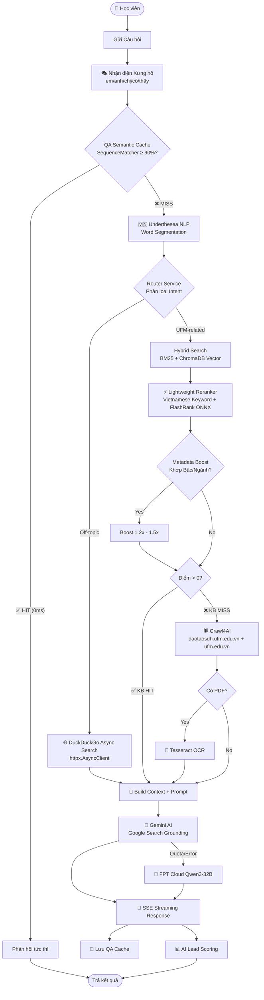

# 🎓 Cô giáo Thắm — UFM AI Chatbot Tuyển sinh Sau đại học

<div align="center">


**Hệ thống Chatbot AI Tư vấn Tuyển sinh Thông minh dành cho Viện Đào tạo Sau đại học — Trường Đại học Tài chính - Marketing (UFM)**

[Demo trực tuyến](#) · [Tài liệu API](#-api-endpoints) · [Hướng dẫn cài đặt](#%EF%B8%8F-hướng-dẫn-cài-đặt--vận-hành)

</div>

---

## ✨ Tính năng nổi bật

| Tính năng | Mô tả |
|:---|:---|
| 🧠 **Hybrid RAG Engine** | Kết hợp BM25 + ChromaDB Vector Search + Lightweight Reranker |
| 🤖 **Dual LLM (Gemini + FPT Cloud)** | Gemini AI làm chính với Google Search grounding, FPT Cloud Qwen3-32B làm fallback |
| 🔍 **Google Search Grounding** | Tự động tìm kiếm Google cho câu hỏi ngoài lề (thời tiết, kiến thức tổng hợp...) |
| 🎭 **Persona "Cô giáo Thắm"** | Giảng viên miền Nam ấm áp, xưng hô động theo vai vế người dùng |
| ⚡ **3-Layer Caching** | HTML Cache (15 phút) + PDF OCR Cache (vĩnh viễn) + QA Semantic Cache |
| 📊 **AI Lead Scoring + CRM** | Chấm điểm tự động 100 điểm, xác suất nhập học Sigmoid, Dashboard CRM |
| 📋 **Đăng ký trực tuyến 3 bước** | Thu thập thông tin cá nhân → Học vấn → Upload giấy tờ |
| 🌐 **Live Web Crawler** | Async crawler với DuckDuckGo search + Crawl4AI cho dữ liệu mới nhất |
| 🏋️ **Lightweight Architecture** | Reranker siêu nhẹ (~4MB ONNX) thay thế model nặng ~560MB |

---

## 🗺️ Kiến trúc Hệ thống

### Tổng quan Kiến trúc



### Stack Công nghệ

| Layer | Công nghệ | Chi tiết |
|:---|:---|:---|
| **LLM chính** | Google Gemini AI | `gemini-flash-latest` + Google Search grounding |
| **LLM fallback** | FPT Cloud | `Qwen3-32B` (OpenAI-compatible API) |
| **Embedding** | `dangvantuan/vietnamese-embedding` | SentenceTransformer, tối ưu cho tiếng Việt |
| **Reranker** | FlashRank ONNX + Vietnamese Keyword Scorer | `ms-marco-TinyBERT-L-2-v2` (~4MB), hybrid scoring |
| **Vector DB** | ChromaDB | Embedded mode, persistent storage |
| **NLP** | Underthesea | Word segmentation tiếng Việt |
| **Web Framework** | FastAPI | Async, SSE streaming, auto OpenAPI docs |
| **Web Crawler** | Crawl4AI + httpx | Async DuckDuckGo search cho câu hỏi off-topic |
| **OCR** | Tesseract + OpenCV | Nhận dạng chữ tiếng Việt từ PDF scan |
| **Frontend** | Vanilla HTML/CSS/JS | Responsive, onboarding 3 bước, CRM dashboard |

---

## 📚 Kho Tri thức (Knowledge Base)

Hệ thống được đào tạo trên **272 tài liệu Markdown** bao gồm:

| Nguồn | Số lượng | Nội dung |
|:---|:---:|:---|
| 📜 Quyết định CTĐT | 13 | Chương trình đào tạo Thạc sĩ & Tiến sĩ (9 ngành ThS + 3 ngành TS) |
| 🌐 Website Sau ĐH | ~120 | Crawl từ `daotaosdh.ufm.edu.vn` (chi tiết ngành, điều kiện, biểu mẫu...) |
| 🏫 Website Chính UFM | ~139 | Crawl từ `ufm.edu.vn` (tin tức, hợp tác quốc tế, hội thảo, lịch sử trường...) |

### Ngành đào tạo được hỗ trợ

**Thạc sĩ (9 ngành):**
Quản trị Kinh doanh · Tài chính - Ngân hàng · Kế toán · Marketing · Quản lý Kinh tế · Kinh doanh Quốc tế · Kinh tế học · Toán Kinh tế · Luật Kinh tế

**Tiến sĩ (3 ngành):**
Quản trị Kinh doanh · Tài chính - Ngân hàng · Quản lý Kinh tế

---

## ⚡ Reranker Siêu nhẹ (v4.0 — Hybrid A+B)

Phiên bản v4.0 thay thế hoàn toàn model reranker nặng `BAAI/bge-reranker-v2-m3` (~560MB, ~1.2GB RAM) bằng kiến trúc hybrid siêu nhẹ:

| Metric | BGE-Reranker-v2-M3 (cũ) | Hybrid A+B (mới) |
|:---|:---:|:---:|
| **Kích thước model** | ~560MB | **~4MB** |
| **RAM sử dụng** | ~1.2GB | **~10MB** |
| **Tốc độ rerank 20 docs** | 200-500ms | **< 5ms** |
| **Yêu cầu GPU** | Có (MPS/CUDA) | **Không cần** |

### Cách hoạt động

```
Layer A — Vietnamese Keyword Scorer (luôn chạy, < 1ms)
├── Underthesea word segmentation
├── Query term coverage (40%)
├── Exact phrase + N-gram matching (30%)
├── Position bonus — tiêu đề/header (15%)
└── Keyword density (15%)

Layer B — FlashRank ONNX (nếu có, ~3ms)
├── ms-marco-TinyBERT-L-2-v2 (~4MB ONNX)
└── ONNX Runtime optimized cho CPU

Final Score = 0.4 × Layer_A + 0.6 × Layer_B
```

---

## 🎭 Persona "Cô giáo Thắm" & Xưng hô Động

Chatbot đóng vai **Cô giáo Thắm** — giảng viên miền Nam ấm áp, tận tâm với hệ thống xưng hô tự động:

| Người dùng xưng | Cô Thắm xưng | Cô Thắm gọi user | Câu chờ hiển thị |
|:---|:---:|:---:|:---|
| "**em** muốn hỏi..." | **cô** | **em** | "Đợi **cô Thắm** xíu nha..." |
| "**anh** cần biết..." | **em** | **anh** | "Đợi **em Thắm** xíu nha..." |
| "**chị** muốn hỏi..." | **em** | **chị** | "Đợi **em Thắm** xíu nha..." |
| "cho **cô** hỏi..." | **em** | **cô** | "Đợi **em Thắm** xíu nha..." |
| Không rõ | Đoán từ tuổi | **bạn** | Tự động theo năm sinh |

**Đặc điểm:**
- 🗣️ Phong cách miền Nam tự nhiên: "Dạ em ơi...", "Ồ hay quá!", "Cô nghĩ vậy nè..."
- 😊 Phản ứng cảm xúc: vui khi user đủ điều kiện, an ủi khi lo lắng, thành thật khi không tìm thấy
- 🔄 Nhất quán xuyên suốt cuộc trò chuyện
- 🌐 Hỏi tào lao cũng trả lời được (Google Search grounding)

---

## 📈 AI Lead Scoring & CRM Dashboard

### Cơ cấu Phân bổ Điểm (Max 100 điểm)

| Nhóm Tiêu Chí | Điểm Tối Đa | Chi Tiết |
|:---|:---:|:---|
| **Hồ sơ năng lực** | **25đ** | Đã tốt nghiệp ĐH (+10đ) · Ngành liên quan (+8đ) · Tuổi vàng 22-45 (+4đ) · Có kinh nghiệm (+3đ) |
| **Mức độ tương tác** | **40đ** | Hỏi học phí (+15đ) · Điều kiện ĐV (+10đ) · Lịch học (+8đ) · Hồ sơ (+8đ) · Deadline (+7đ) · ≥5 câu hỏi (+6đ) |
| **Hành động cụ thể** | **35đ** | Nộp hồ sơ (+35đ) · Hoàn thành ≥80% (+28đ) · Bắt đầu ĐK (+12đ) · Khẩn cấp (+10đ) · Quay lại (+8đ) |

### Xác suất Nhập học (Sigmoid)

$$P(\text{enroll}) = \frac{1}{1 + e^{-0.1 \times (\text{Score} - 55)}}$$

### Phân loại Lead

| Điểm | Grade | Trạng thái | Nhãn CRM |
|:---|:---:|:---|:---|
| ≥ 75 | **A** | `hot_lead` | 🔥 Tiềm năng cao |
| 55–74 | **B** | `interested` | ⭐ Quan tâm |
| 35–54 | **C** | `follow_up` | 💡 Cần theo dõi |
| < 35 | **D** | `new` | ❄️ Mới tiếp cận |

---

## ⚡ Caching 3 Tầng

| Tầng | Loại | TTL | Chi tiết |
|:---|:---|:---:|:---|
| **1. HTML Cache** | In-Memory (TTLCache) | 15 phút | Cache trang web crawl trực tuyến |
| **2. PDF Cache** | Persistent Disk | Vĩnh viễn | OCR text lưu `./app/database/pdfs/`, MD5 hash URL |
| **3. QA Cache** | Memory + Disk Sync | Vĩnh viễn | SequenceMatcher ≥90%, giới hạn 1000 QA, scan 100 mới nhất |

---

## 🏗️ Cấu trúc Dự án

```text
ufm-chatbot-cotham/
├── app/
│   ├── config.py                 # Cấu hình tập trung (.env) — Pydantic Settings
│   ├── main.py                   # FastAPI entrypoint, lifespan, CORS, static mount
│   ├── models.py                 # Pydantic schemas (Chat, Guest, CRM, Enrollment)
│   ├── database/                 # Dữ liệu runtime (QA cache, PDF OCR text)
│   │   ├── qa_cache.json         # QA Semantic Cache (1000 QA mới nhất)
│   │   └── pdfs/                 # PDF OCR text cache (persistent)
│   ├── knowledge_base/           # 272 tài liệu Markdown (QĐ + website crawl)
│   ├── routes/
│   │   ├── chat.py               # POST /api/chat — RAG pipeline + SSE streaming
│   │   ├── crm.py                # CRM dashboard API (login, leads, analytics)
│   │   ├── enrollment.py         # Đăng ký nhập học 3 bước + upload giấy tờ
│   │   ├── guest.py              # Onboarding, session init, profile
│   │   ├── handoff.py            # Chuyển giao sang tư vấn viên thực tế
│   │   └── health.py             # GET /health — Liveness check
│   └── services/
│       ├── llm_service.py        # Dual LLM: Gemini AI (chính) + FPT Cloud (fallback)
│       ├── kb_service.py         # Hybrid RAG: BM25 + Vector + Reranker + Metadata Boost
│       ├── reranker_service.py   # ⚡ Lightweight Hybrid Reranker (Keyword + FlashRank ONNX)
│       ├── vector_service.py     # ChromaDB + vietnamese-embedding SentenceTransformer
│       ├── crawler_service.py    # Async web crawler (Crawl4AI + DuckDuckGo httpx)
│       ├── cache_service.py      # 3-layer caching (HTML, PDF, QA Semantic)
│       ├── memory_service.py     # Session memory, pronoun detection, conversation history
│       ├── context_service.py    # Context builder + confidence estimation
│       ├── pdf_service.py        # PDF OCR (Tesseract + OpenCV)
│       ├── scoring_engine.py     # AI Lead Scoring engine (Sigmoid probability)
│       ├── crm_service.py        # CRM data management + lead tracking
│       ├── suggestion_service.py # Gợi ý câu hỏi contextual
│       ├── enrollment_service.py # Enrollment workflow management
│       ├── handoff_service.py    # Handoff to human advisor
│       └── router_service.py     # Intent classification + routing
├── static/
│   ├── index.html                # Giao diện chat responsive
│   ├── app.js                    # Frontend logic (onboarding, chat, enrollment)
│   ├── style.css                 # UI styling
│   └── crm/                     # CRM Dashboard (login, leads table, analytics)
├── data/models/                  # FlashRank ONNX model cache (~4MB)
├── Dockerfile                    # Docker image (Poppler + Tesseract OCR + Python)
├── docker-compose.yml            # Container orchestration + volumes
├── requirements.txt              # Python dependencies
├── .env.example                  # Template biến môi trường
└── README.md
```

---

## 🛠️ Hướng dẫn Cài đặt & Vận hành

### Yêu cầu Hệ thống

| Yêu cầu | Tối thiểu | Khuyến nghị |
|:---|:---|:---|
| **OS** | Linux / macOS / Windows | Ubuntu 22.04+ hoặc macOS |
| **Python** | 3.10+ | 3.11+ |
| **RAM** | 2GB | 4GB+ |
| **Disk** | 2GB | 5GB+ |
| **GPU** | Không bắt buộc | Có GPU sẽ nhanh hơn cho embedding |

> **📝 Lưu ý:** Phiên bản v4.0 đã tối ưu hóa giảm ~1.2GB RAM nhờ thay thế reranker nặng bằng FlashRank ONNX siêu nhẹ.

### Cách 1: Docker (Khuyên dùng)

```bash
# 1. Clone repo
git clone https://github.com/phapsuto/ufm-chatbot-cotham.git
cd ufm-chatbot-cotham

# 2. Tạo file .env
cp .env.example .env
# Sửa file .env, thêm API keys:
#   GEMINI_API_KEY=your_gemini_api_key
#   FPT_CLOUD_API_KEY=your_fpt_cloud_api_key

# 3. Khởi chạy
docker compose up --build -d

# 4. Truy cập
# Chatbot: http://localhost:8001
# CRM:     http://localhost:8001/crm
```

### Cách 2: Local Development

```bash
# 1. Cài đặt hệ thống (macOS)
brew install poppler tesseract tesseract-lang

# 1. Cài đặt hệ thống (Ubuntu/Debian)
sudo apt-get install -y poppler-utils tesseract-ocr tesseract-ocr-vie

# 2. Cài đặt Python dependencies
pip3 install -r requirements.txt

# 3. Tạo .env
cp .env.example .env
# Thêm GEMINI_API_KEY và/hoặc FPT_CLOUD_API_KEY

# 4. Khởi chạy
uvicorn app.main:app --port 8000 --reload

# 5. Truy cập: http://localhost:8000
```

### Tải Model AI lần đầu

Lần chạy đầu tiên, hệ thống sẽ tự động tải:

| Model | Kích thước | Mục đích |
|:---|:---:|:---|
| `dangvantuan/vietnamese-embedding` | ~400MB | Vector embedding tiếng Việt |
| `ms-marco-TinyBERT-L-2-v2` | ~4MB | FlashRank ONNX reranker |

Để tăng tốc tải 10x:
```bash
export HF_HUB_ENABLE_HF_TRANSFER=1
```

---

## ⚙️ Biến Môi trường (.env)

| Biến | Mặc định | Mô tả |
|:---|:---:|:---|
| `GEMINI_API_KEY` | *(trống)* | **(Khuyên dùng)** API Key Google Gemini AI |
| `GEMINI_DEFAULT_MODEL` | `gemini-flash-latest` | Model Gemini mặc định |
| `FPT_CLOUD_API_KEY` | *(trống)* | API Key FPT Cloud (fallback LLM) |
| `FPT_CLOUD_BASE_URL` | `https://mkp-api.fptcloud.com/v1` | Endpoint FPT Cloud |
| `FPT_CLOUD_DEFAULT_MODEL` | `Qwen3-32B` | Model FPT Cloud mặc định |
| `LLM_TEMPERATURE` | `0.7` | Độ sáng tạo (0.0–1.0) |
| `LLM_MAX_TOKENS` | `2048` | Giới hạn token phản hồi |
| `ALLOWED_DOMAIN` | `daotaosdh.ufm.edu.vn` | Domain được phép crawl |
| `CRM_DASHBOARD_PASSWORD` | `ufm_crm_2026` | Mật khẩu CRM Dashboard |
| `PORT` | `8000` | Port ứng dụng |
| `DEBUG_MODE` | `False` | Bật log debug chi tiết |
| `TESSERACT_LANG` | `vie+eng` | Ngôn ngữ OCR |

---

## 🔌 API Endpoints

### Chat & RAG
| Method | Endpoint | Mô tả |
|:---:|:---|:---|
| `POST` | `/api/chat` | Chat streaming (SSE) — RAG pipeline đầy đủ |

### Guest & Onboarding
| Method | Endpoint | Mô tả |
|:---:|:---|:---|
| `POST` | `/api/guest/register` | Đăng ký khách, tạo session |

### Enrollment (Đăng ký nhập học)
| Method | Endpoint | Mô tả |
|:---:|:---|:---|
| `POST` | `/api/enrollment/start` | Bắt đầu hồ sơ đăng ký |
| `POST` | `/api/enrollment/info` | Cập nhật thông tin từng bước |
| `POST` | `/api/enrollment/upload` | Upload giấy tờ (PDF/JPG/PNG) |
| `POST` | `/api/enrollment/submit` | Nộp hồ sơ hoàn tất |

### CRM & Quản trị
| Method | Endpoint | Mô tả |
|:---:|:---|:---|
| `POST` | `/api/crm/login` | Đăng nhập CRM Dashboard |
| `GET` | `/api/crm/leads` | Danh sách leads + điểm số + xác suất |
| `GET` | `/api/crm/lead/{session_id}` | Chi tiết 1 lead (lịch sử, phân tích) |
| `POST` | `/api/handoff` | Chuyển giao sang tư vấn viên |

### System
| Method | Endpoint | Mô tả |
|:---:|:---|:---|
| `GET` | `/health` | Health check (`{"status": "ok", "version": "4.0.0"}`) |

---

## 📄 Changelog

### v4.0.0 (2025-05-28)
- 🔄 **Dual LLM:** Gemini AI (chính) + FPT Cloud Qwen3-32B (fallback)
- 🌐 **Google Search Grounding:** Tự động search Google cho câu hỏi off-topic
- ⚡ **Lightweight Reranker:** FlashRank ONNX (~4MB) thay thế BGE-M3 (~560MB), giảm 1.2GB RAM
- 🎭 **Dynamic Typing Messages:** "Đợi cô/em Thắm xíu nha" theo ngôi xưng
- 🔧 **Performance Audit:** Fix 14 issues (async DDG search, KB init, cache optimization)
- 🌐 **Async Web Search:** DuckDuckGo search chuyển sang httpx async (không còn block event loop)
- 📚 **272 tài liệu KB:** Mở rộng từ website chính UFM (`ufm.edu.vn`)

### v3.x
- Hybrid RAG (BM25 + ChromaDB Vector)
- AI Lead Scoring + CRM Dashboard
- Onboarding 3 bước + Enrollment
- QA Semantic Cache

---

## 📜 License

Dự án được nghiên cứu và phát triển chuyên biệt nhằm tối ưu hóa công tác tuyển sinh Sau đại học của **Trường Đại học Tài chính - Marketing (UFM)**.

---

<div align="center">
  <sub>Built with ❤️ for UFM Postgraduate Admissions</sub>
</div>
